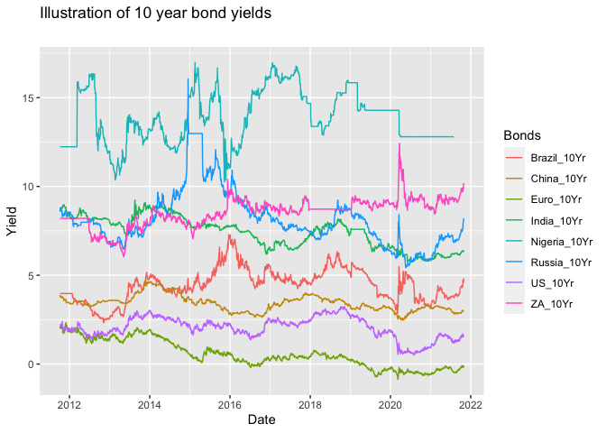
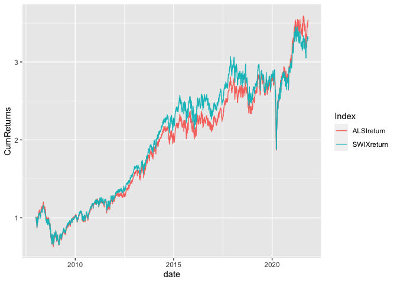
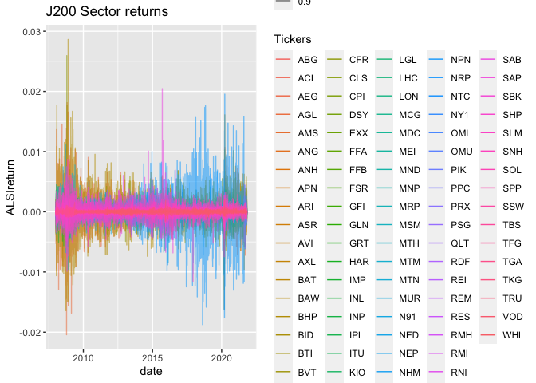
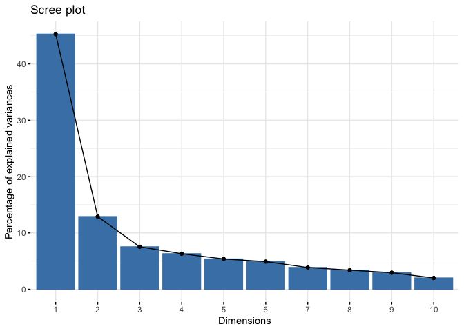

README
================
2022-11-25

# Purpose

This is the platform for my Financial Econometrics exam in 2022. Please
note: fmxdat::theme_fmx did not work at all. I continually got an error
saying that “ht” is missing. The “rportfolios” packages also proved
problematic as it is not available anymore. I had to manually download
the random.bounded function and attempted to use it. This proveed
fruitless.

# Creating folders

``` r
devtools::install_github("Nicktz/fmxdat")
```

    ## Skipping install of 'fmxdat' from a github remote, the SHA1 (4223d1a3) has not changed since last install.
    ##   Use `force = TRUE` to force installation

``` r
#CHOSEN_LOCATION <- "/Users/joshuastrydom/Desktop/20718284_FinMetrics_Exam2022"
#fmxdat::make_project("/Users/joshuastrydom/Desktop/20718284_FinMetrics_Exam2022", Mac = TRUE)
#fmxdat::make_project(FilePath = glue::glue("{CHOSEN_LOCATION}Questions/"), 
#                     ProjNam = "20718284", Open = T)

#Texevier::create_template(directory = glue::glue("{CHOSEN_LOCATION}/Questions/"), template_name = "Question1")
#Texevier::create_template(directory = glue::glue("{CHOSEN_LOCATION}/Questions/"), template_name = "Question2")
#Texevier::create_template(directory = glue::glue("{CHOSEN_LOCATION}/Questions/"), template_name = "Question3")
#Texevier::create_template(directory = glue::glue("{CHOSEN_LOCATION}/Questions/"), template_name = "Question4")
#Texevier::create_template(directory = glue::glue("{CHOSEN_LOCATION}/Questions/"), template_name = "Question5")
#Texevier::create_template(directory = glue::glue("{CHOSEN_LOCATION}/Questions/"), template_name = "Question6")
#Texevier::create_template(directory = glue::glue("{CHOSEN_LOCATION}/Questions/"), template_name = "Question7")
```

# Loading packages

``` r
pacman::p_load("tidyr", "tbl2xts","devtools","lubridate", "readr", "PerformanceAnalytics", "ggplot2", "dplyr", "rmsfuns", "tibble", "knitr", "lubridate", "pacman", "PortRisk", "psych", "quadprog", "RcppRoll", "rmarkdown", "rmgarch", "rportfolio", "tbl2xts", "Texevier", "tidyfit", "tidyverse", "broom", "xts", "zoo", "factoextra", "FactoMineR", "fEcofin", "fmxdat", "glue", "huxtable")
library(fmxdat)
```

# Question 1

## Loaded the data

``` r
library(tidyverse)
ASISA <- read_rds("~/Desktop/20718284_FinMetrics_Exam2022/data/ASISA.rds")
BM <- read_rds("~/Desktop/20718284_FinMetrics_Exam2022/data/Capped_SWIX.rds")
AI_Fund <- read_rds("~/Desktop/20718284_FinMetrics_Exam2022/data/AI_Max_Fund.rds")
```

## Manipulated the data

``` r
library(dplyr)
library(tbl2xts)
library(lubridate)
library(fmxdat)

ASISA.tbl <- ASISA |> 
    arrange(date) |> 
    group_by(Name) |> 
    filter(date > dplyr::first(date)) |> 
    mutate(Returns = coalesce(Returns, 0)) |> 
    mutate(CP = cumprod(1+Returns)) |> 
    ungroup() |>
    rename(Tickers = Name)

BM.tbl <- BM |> 
    arrange(date) |> 
    mutate(Rets = coalesce(Returns, 0)) |> 
    mutate(CP = cumprod(1+Rets)) |> 
    ungroup() 

AI_Fund.tbl <- AI_Fund |> 
    select(date, Tickers, Returns) |> 
    arrange(date) |> 
    mutate(Rets = coalesce(Returns, 0)) |> 
    mutate(CP = cumprod(1 + Rets)) |> 
    ungroup() 
```

As the ASISA data set is large, funds were selected at random to be
compared to our fund and to the capped SWIX. I decided to randomly draw
10% of the funds.

``` r
randomdraw <- sample(1:227, 27)
```

I thus consider only funds 193, 149, 96, 33, 21, 122, 72, 99, 7, 211,
226, 198, 144, 106, 223, 209, 188, 163, 152, 43, 32, 169, 94, 11, 138,
67 and 16.

``` r
ASISA.roll <- ASISA.tbl |> 
    filter(Tickers %in% c("Fund_193", "Fund_149", "Fund_96", "Fund_33", "Fund_21", "Fund_122", "Fund_72", "Fund_99", "Fund_7", "Fund_211", "Fund_226", "Fund_198", "Fund_144", "Fund_106", "Fund_223", "Fund_209", "Fund_188", "Fund_163", "Fund_152", "Fund_43", "Fund_32", "Fund_169", "Fund_94", "Fund_11", "Fund_138", "Fund_67", "Fund_16")) |> 
    mutate(Rets = coalesce(Returns, 0)) |> 
    select(date, Tickers, Returns, Rets, CP)
```

I then joined the datasets that were created.

``` r
longfunds <- bind_rows(AI_Fund.tbl, BM.tbl, ASISA.roll)
longfunds_plot <- ggplot(longfunds) + 
    geom_line(aes(date, CP, color = Tickers)) + 
    labs(title = "Illustration of Cumulative Returns of various Indices with differing start dates", 
    subtitle = "", caption = "Note:\nDistortions emerge as starting dates differ.") #+ 
    #theme_fmx(title.size = ggpts(20), subtitle.size = ggpts(5), 
        #caption.size = ggpts(15), CustomCaption = T)
```

To properly inspect the data i plotted it.

``` r
longfunds_plot +
    coord_trans(y = "log10") + 
    labs(title = paste0(longfunds_plot$labels$title, 
    "\nLog Scaled"), y = "Log Scaled Cumulative Returns")
```

<!-- -->

Now to compare on a rolling returns basis.

``` r
library(Rcpp)
library(RcppRoll)
plotdf <- longfunds %>% group_by(Tickers) %>% mutate(RollRets = RcppRoll::roll_prod(1 + Returns, 36, fill = NA, 
    align = "right")^(12/36) - 1) %>% group_by(date) %>% filter(any(!is.na(RollRets))) %>% ungroup()

g <- plotdf %>% 
    ggplot() + 
    geom_line(aes(date, RollRets, color = Tickers), alpha = 0.7, size = 0.75) + 
    labs(title = "Illustration of Rolling 3 Year Annualized Returns of various Indices with differing start dates", 
    subtitle = "", x = "", y = "Rolling 3 year Returns (Ann.)", 
    caption = "Note:\nDistortions are not evident now.") #+ 
    #theme_fmx(title.size = ggpts(30), subtitle.size = ggpts(5), caption.size = ggpts(25), CustomCaption = T) + 
    #fmx_cols()
```

``` r
finplot(g, x.date.dist = "1 year", x.date.type = "%Y", x.vert = T, y.pct = T, y.pct_acc = 1)
```

<!-- -->

Now for rolling standard deviation.

``` r
plot_dlog <- longfunds |> 
    mutate(logreturns = log(Returns + 1)) |> 
    select(date, Tickers, logreturns) |> 
    mutate(RollSD = RcppRoll::roll_sd(1 + logreturns, 36, fill = NA, align = "right") * sqrt(12)) |> 
    filter(!is.na(RollSD))

gg <- plot_dlog |> 
    ggplot() + 
    geom_line(aes(date, RollSD, color = Tickers), alpha = 0.7, size = 0.75) + 
    labs(title = "Illustration of Rolling 3 Year Annualized SD of various Indices with differing start dates", 
    subtitle = "", x = "", y = "Rolling 3 year Returns (Ann.)", 
    caption = "Note:\nDistortions are not evident now.") #+ 
    #theme_fmx(title.size = ggpts(30), subtitle.size = ggpts(5), caption.size = ggpts(25), CustomCaption = T) + 
    #fmx_cols()
```

``` r
finplot(gg, x.date.dist = "1 year", x.date.type = "%Y", x.vert = T, 
    y.pct = T, y.pct_acc = 1)  
```

<!-- -->

# Question 2

The first step involved loading the data.

``` r
library(tidyverse)
SA_Bonds <- read_rds("~/Desktop/20718284_FinMetrics_Exam2022/data/SA_Bonds.rds") 
BE_Infl <- read_rds("~/Desktop/20718284_FinMetrics_Exam2022/data/BE_Infl.rds") 
bonds_2y <- read_rds("~/Desktop/20718284_FinMetrics_Exam2022/data/bonds_2y.rds") 
bonds_10y <- read_rds("~/Desktop/20718284_FinMetrics_Exam2022/data/bonds_10y.rds") 
usdzar <- read_rds("~/Desktop/20718284_FinMetrics_Exam2022/data/usdzar.rds")
ZA_Infl <- read_rds("~/Desktop/20718284_FinMetrics_Exam2022/data/ZA_Infl.rds")
IV <- read_rds("~/Desktop/20718284_FinMetrics_Exam2022/data/IV.rds")
```

I then chose to inspect the data visually. Since the data is daily, I
limited my inspection to the first day of each month.

``` r
library(tbl2xts)
library(ggplot2)

class(SA_Bonds)
```

    ## [1] "tbl_df"     "tbl"        "data.frame"

``` r
SA_Bondspread.xts <- SA_Bonds |>
    mutate(M3v2Y = ZA_2Yr - SA_3M) |> 
    mutate(M3v10Y = ZA_10Yr - SA_3M) |> 
    mutate(Y2v10Y = ZA_10Yr - ZA_2Yr) |> 
    select(date, M3v2Y, M3v10Y, Y2v10Y) |> 
    tbl_xts()
SA_bondspreadlong <- SA_Bondspread.xts |> 
    xts_tbl() |> 
    gather(key = "Spread", value = "value", -date)
```

``` r
ggplot(SA_bondspreadlong) +
    geom_line(aes(date, value, color = Spread)) +
    labs(title = "Illustration of bond spreads", 
    subtitle = "", x = "", y = "Date", 
    caption = "Note:\nSpreads are calculated as the difference in the yield on two different bonds.")
```

<!-- -->

One can clearly see that the yield spreads become far larger from 2020
from an historical context. The spread between the 3 month and 10 year
bonds as well as the spread between the 2 year and 10 year bonds are
greatest.

Next, I made use of the autoplot function of ggplot2 to plot the entire
series. One can immediately see that the longer dated bond spread as
largest and become far greater post-2020.

## International 2 year bond yields

Comparing the local yields to comparable international yields:

``` r
Brazil_2Yr <- bonds_2y |> 
    filter(Name %in% "Brazil_2yr") |> 
    filter(date > "2011-10-03") |> 
    rename(Brazil_2Yr = Bond_2Yr) |> 
    tbl_xts()
India_2Yr <- bonds_2y |> 
    filter(Name %in% "India_2yr") |> 
    filter(date > "2011-10-03") |> 
    rename(India_2Yr = Bond_2Yr) |> 
    tbl_xts()
Russia_2Yr <- bonds_2y |> 
    filter(Name %in% "Russia_2yr") |> 
    filter(date > "2011-10-03") |> 
    rename(Russia_2Yr = Bond_2Yr) |> 
    tbl_xts()
China_2Yr <- bonds_2y |> 
    filter(Name %in% "CHINA_2yr") |> 
    filter(date > "2011-10-03") |> 
    rename(China_2Yr = Bond_2Yr) |> 
    tbl_xts()
Euro_2Yr <- bonds_2y |> 
    filter(Name %in% "EURO_2yr") |> 
    filter(date > "2011-10-03") |> 
    rename(Euro_2Yr = Bond_2Yr) |> 
    tbl_xts()
Nigeria_2Yr <- bonds_2y |> 
    filter(Name %in% "Nigeria_2yr") |> 
    filter(date > "2011-10-03") |> 
    rename(Nigeria_2Yr = Bond_2Yr) |> 
    tbl_xts()
SA_2Yr <- SA_Bonds |> 
    select(date, ZA_2Yr) |> 
    filter(date > "2011-10-03") |> 
    tbl_xts()
US_2Yr <- bonds_2y |> 
    filter(Name %in% "US_2yr") |> 
    filter(date > "2011-10-03") |> 
    rename(US_2Yr = Bond_2Yr) |> 
    tbl_xts()

Joined_2Yr <- merge.xts(SA_2Yr, Nigeria_2Yr, Brazil_2Yr, India_2Yr, Russia_2Yr, China_2Yr, Euro_2Yr, US_2Yr, all = TRUE)
Joined_2Yr.tbl <- Joined_2Yr |> 
    xts_tbl() |> 
    gather(key = "Bonds", value = "value", -date)
```

### Plot of the two year bond yields

``` r
ggplot(Joined_2Yr.tbl) +
    geom_line(aes(date, value, color = Bonds)) +
    labs(title = "Illustration of 2 year bond yields", 
    subtitle = "", x = "Date", y = "Yield")
```

<!-- -->

## International 10 year bond yields

``` r
Brazil_10Yr <- bonds_10y |> 
    filter(Name %in% "Brazil_10Yr") |> 
    filter(date > "2011-10-06") |> 
    rename(Brazil_10Yr = Bond_10Yr) |> 
    tbl_xts()
India_10Yr <- bonds_10y |> 
    filter(Name %in% "India_10Yr") |> 
    filter(date > "2011-10-06") |> 
    rename(India_10Yr = Bond_10Yr) |> 
    tbl_xts()
Russia_10Yr <- bonds_10y |> 
    filter(Name %in% "Russia_10Yr") |> 
    filter(date > "2011-10-06") |> 
    rename(Russia_10Yr = Bond_10Yr) |> 
    tbl_xts()
China_10Yr <- bonds_10y |> 
    filter(Name %in% "CHINA_10Yr") |> 
    filter(date > "2011-10-06") |> 
    rename(China_10Yr = Bond_10Yr) |> 
    tbl_xts()
Euro_10Yr <- bonds_10y |> 
    filter(Name %in% "EURO_10Yr") |> 
    filter(date > "2011-10-06") |> 
    rename(Euro_10Yr = Bond_10Yr) |> 
    tbl_xts()
Nigeria_10Yr <- bonds_10y |> 
    filter(Name %in% "Nigeria_10Yr") |> 
    filter(date > "2011-10-06") |> 
    rename(Nigeria_10Yr = Bond_10Yr) |> 
    tbl_xts()
SA_10Yr <- SA_Bonds |> 
    select(date, ZA_10Yr) |> 
    filter(date > "2011-10-06") |> 
    tbl_xts()
US_10Yr <- bonds_10y |> 
    filter(Name %in% "US_10Yr") |> 
    filter(date > "2011-10-06") |> 
    rename(US_10Yr = Bond_10Yr) |> 
    tbl_xts()

Joined_10Yr <- merge.xts(SA_10Yr, Nigeria_10Yr, Brazil_10Yr, India_10Yr, Russia_10Yr, China_10Yr, Euro_10Yr, US_10Yr, all = TRUE)
Joined_10Yr.tbl <- Joined_10Yr |> 
    xts_tbl() |> 
    gather(key = "Bonds", value = "value", -date)
```

### Plot of the ten year bond yields

``` r
ggplot(Joined_10Yr.tbl) +
    geom_line(aes(date, value, color = Bonds)) +
    labs(title = "Illustration of 10 year bond yields", 
    subtitle = "", x = "Date", y = "Yield")
```

<!-- -->

## Exchange rate and inflation

Now, looking into the usdzar.rds and BE_Infl.rds datasets for some
background information.

``` r
usdzar.xts <- usdzar |> 
    rename(USDZAR = Price) |> 
    mutate(ExchangeRateChange = USDZAR/lag(USDZAR)-1) |> 
    filter(date > dplyr::first(date)) |> 
    tbl_xts()
BE_infl.xts <- BE_Infl |> 
    rename(BEinflation = Price) |> 
    mutate(BEInflationChange = BEinflation/lag(BEinflation)-1) |> 
    filter(date > dplyr::first(date)) |> 
    tbl_xts()
ZA_infl.xts <- ZA_Infl |> 
    rename(ZARinfl = Price) |> 
    mutate(ZAInflationChange = ZARinfl/lag(ZARinfl)-1) |> 
    filter(date > dplyr::first(date)) |> 
    tbl_xts()

usdzar_BEinfl_ZAinfl <- merge.xts(usdzar.xts, BE_infl.xts, ZA_infl.xts, all = TRUE) |> 
    na.omit()

usdzar_BEinfl_ZAinfl_level <- usdzar_BEinfl_ZAinfl |> 
    xts_tbl() |> 
    select(date, USDZAR, BEinflation, ZARinfl) |> 
    gather(key = "Variables", value = "value", -date)
usdzar_BEinfl_change <- usdzar_BEinfl_ZAinfl |> 
    xts_tbl() |> 
    select(date, ExchangeRateChange, BEInflationChange) |> 
    gather(key = "Variables", value = "value", -date)
ZARinfl_change <- usdzar_BEinfl_ZAinfl |> 
    xts_tbl() |> 
    select(date, ZAInflationChange) |> 
    gather(key = "Variables", value = "value", -date)
```

### Exchange rate and BE inflation plot

``` r
ggplot(usdzar_BEinfl_change) +
    geom_line(aes(date, value, color = Variables)) +
    labs(title = "Illustration of change in exchange rate and inflation", 
    subtitle = "", x = "Date", y = "")
```

<!-- -->

### Exchange rate, BE inflation and ZAR inflation plot

``` r
ggplot(usdzar_BEinfl_ZAinfl_level) +
    geom_line(aes(date, value, color = Variables)) +
    labs(title = "Illustration of level exchange rate and inflation", 
    subtitle = "", x = "Date", y = "")
```

<!-- -->

### ZAR inflation plot

``` r
ggplot(ZARinfl_change) +
    geom_line(aes(date, value, color = Variables)) +
    labs(title = "Illustration of change in ZAR inflation", 
    subtitle = "", x = "Date", y = "")
```

<!-- -->

One might notice that the inflation rate has proven to be historically
more volatile post 2020.

## Inflation volatility

``` r
IV.tbl <- IV |> 
    spread(Name, Price) |> 
    gather(key = "Variable", value = "value", -date)
```

### Inflation volatility plot

``` r
ggplot(IV.tbl) +
    geom_line(aes(date, value, color = Variable)) +
    labs(title = "Illustration of inflation volatility", 
    subtitle = "", x = "Date", y = "")
```

<!-- -->

Inflation volatility spiked post-2020.

# Question 3

## Load the data

``` r
library(PerformanceAnalytics)
library(TTR)
```

    ## 
    ## Attaching package: 'TTR'

    ## The following object is masked from 'package:PortRisk':
    ## 
    ##     volatility

``` r
T40 <- read_rds("~/Desktop/20718284_FinMetrics_Exam2022/data/T40.rds")
RebDays <- read_rds("~/Desktop/20718284_FinMetrics_Exam2022/data/Rebalance_days.rds")
```

## Compare performance of ALSI and SWIX

To compare the performance of the ALSI and SWIX based on their
respective weightings of stocks.

``` r
T40 <- T40 |> 
    mutate(J200 = ifelse(is.na(J200), 0, J200),
           J400 = ifelse(is.na(J400), 0, J400)) |> 
    mutate(ALSIreturn = Return*J200) |> 
    mutate(SWIXreturn = Return*J400) |> 
    mutate(ALSIreturn = ifelse(is.na(ALSIreturn), 0, ALSIreturn),
           SWIXreturn = ifelse(is.na(SWIXreturn), 0, SWIXreturn))

J200_dailyreturns <- aggregate(x = T40["ALSIreturn"],
                     FUN = sum,
                     by = list(Date = T40$date)) |> 
    gather(Index, Return, -Date) |>
    mutate(CumRet = cumprod(1 + Return))
J200_spread <- J200_dailyreturns |> 
    tbl_xts(cols_to_xts = CumRet, spread_by = Index)
```

    ## The spread_by column only has one category. 
    ## Hence only the column name was changed...

``` r
J400_dailyreturns <- aggregate(x = T40["SWIXreturn"],
                     FUN = sum,
                     by = list(Date = T40$date)) |> 
    gather(Index, Return, -Date) |>
    mutate(CumRet = cumprod(1 + Return))
J400_spread <- J400_dailyreturns |> 
    tbl_xts(cols_to_xts = CumRet, spread_by = Index)
```

    ## The spread_by column only has one category. 
    ## Hence only the column name was changed...

``` r
ALSI_SWIX <- merge.xts(J200_spread, J400_spread, all = TRUE) |> 
    xts_tbl() |> 
    gather(key = "Index", value = "CumReturns", -date)
```

### Compare performance of ALSI and SWIX plot

``` r
ggplot(ALSI_SWIX) +
    geom_line(aes(date, CumReturns, color = Index))
```

<!-- -->

## Rolling returns

``` r
library(fmxdat)
library(dplyr)
J200_spread.roll <- J200_dailyreturns |> 
    tbl_xts(cols_to_xts = Return, spread_by = Index)
```

    ## The spread_by column only has one category. 
    ## Hence only the column name was changed...

``` r
names(J200_spread.roll)[1] <- 'ALSI'
J400_spread.roll <- J400_dailyreturns |> 
    tbl_xts(cols_to_xts = Return, spread_by = Index)
```

    ## The spread_by column only has one category. 
    ## Hence only the column name was changed...

``` r
names(J400_spread.roll)[1] <- 'SWIX'

ALSI_SWIX.xts <- merge.xts(J200_spread.roll, J400_spread.roll, all = TRUE)
ALSI_SWIX_plot.xts <- bind_rows(
      ALSI_SWIX.xts %>% tail(6) %>% PerformanceAnalytics::Return.annualized(., scale = 12) %>% data.frame() %>% mutate(Freq = "A"),
      
      ALSI_SWIX.xts %>% tail(12) %>% PerformanceAnalytics::Return.annualized(., scale = 12) %>% data.frame() %>% mutate(Freq = "B"),
      
      ALSI_SWIX.xts %>% tail(36) %>% PerformanceAnalytics::Return.annualized(., scale = 12) %>% data.frame() %>% mutate(Freq = "C"),
      
      ALSI_SWIX.xts %>% tail(60) %>% PerformanceAnalytics::Return.annualized(., scale = 12) %>% data.frame() %>% mutate(Freq = "D"),
      
    ) %>% data.frame() %>% gather(Tickers, mu, -Freq)

to_string <- as_labeller(c(`A` = "6 Months", `B` = "1 Year", `C` = "3 Years", `D` = "5 Years"))

ALSISWIXg <- ALSI_SWIX_plot.xts |> 
    ggplot() + 
    geom_bar( aes(Tickers, mu, fill = Tickers), stat="identity") + 
    facet_wrap(~Freq, labeller = to_string, nrow = 1) + 
    labs(x = "", y = "Returns (Ann.)" , caption = "Note:\nReturns in excess of a year are in annualized terms.") +
    fmx_fills() + 
    geom_label(aes(Tickers, mu, label = paste0( round(mu, 4)*100, "%" )), size = ggpts(8), alpha = 0.35, fontface = "bold", nudge_y = 0.002) + 
    #theme_fmx(CustomCaption = T, title.size = ggpts(43), subtitle.size = ggpts(38), 
    #            caption.size = ggpts(30), 
            
    #            axis.size = ggpts(37), 
            
    #            legend.size = ggpts(35),legend.pos = "top") +
    theme(axis.text.x = element_blank(), axis.title.y = element_text(vjust=2)) + 
    theme(strip.text.x = element_text(face = "bold", size = ggpts(35), margin = margin(.1, 0, .1, 0, "cm")))
```

### Rolling returns plot

``` r
ALSISWIXg
```

<!-- -->

## Separating the J200 and J400

``` r
T40_J200 <- T40 |> 
    select(-J400, -Short.Name, -SWIXreturn) |>
    group_by(Tickers) |>
    arrange(date) |>
    ungroup() |> 
    mutate(Tickers = gsub(" SJ Equity", "", Tickers)) |> 
    mutate(ALSIreturn = ifelse(is.na(ALSIreturn), 0, ALSIreturn))

T40_J400 <- T40 |> 
    select(-J200, -Short.Name, -ALSIreturn) |>
    group_by(Tickers) |>
    arrange(date) |>
    ungroup() |> 
    mutate(Tickers = gsub(" SJ Equity", "", Tickers))
```

### J200 plot

``` r
ggplot(T40_J200) +
    geom_line(aes(x = date, y = ALSIreturn, color = Tickers, alpha = 0.9)) +
    ggtitle("J200 Sector returns")
```

<!-- -->

### J400 plot

``` r
ggplot(T40_J400) +
    geom_line(aes(x = date, y = SWIXreturn, color = Tickers, alpha = 0.9)) +
    ggtitle("J400 Sector returns")
```

<!-- -->

## Larg caps stocks

``` r
J200_large <- T40_J200 |> 
    filter(Index_Name %in% "Large_Caps")
J200_large <- aggregate(x = J200_large["ALSIreturn"],
                     FUN = sum,
                     by = list(Date = J200_large$date)) |> 
    gather(Index, Return, -Date) |>
    mutate(CumRet = cumprod(1 + Return)) |> 
    tbl_xts(cols_to_xts = CumRet, spread_by = Index)
```

    ## The spread_by column only has one category. 
    ## Hence only the column name was changed...

``` r
J400_large <- T40_J400 |> 
    filter(Index_Name %in% "Large_Caps")
J400_large <- aggregate(x = J400_large["SWIXreturn"],
                     FUN = sum,
                     by = list(Date = J400_large$date)) |> 
    gather(Index, Return, -Date) |>
    mutate(CumRet = cumprod(1 + Return)) |> 
    tbl_xts(cols_to_xts = CumRet, spread_by = Index)
```

    ## The spread_by column only has one category. 
    ## Hence only the column name was changed...

``` r
ALSI_SWIX_large <- merge.xts(J200_large, J400_large, all = TRUE) |> 
    xts_tbl() |> 
    gather(key = "Index", value = "CumReturns", -date)
```

### Large cap plots

``` r
ggplot(ALSI_SWIX_large) +
    geom_line(aes(date, CumReturns, color = Index))
```

<!-- -->

## Mid cap stocks

``` r
J200_mid <- T40_J200 |> 
    filter(Index_Name %in% "Mid_Caps")
J200_mid <- aggregate(x = J200_mid["ALSIreturn"],
                     FUN = sum,
                     by = list(Date = J200_mid$date)) |> 
    gather(Index, Return, -Date) |>
    mutate(CumRet = cumprod(1 + Return)) |> 
    tbl_xts(cols_to_xts = CumRet, spread_by = Index)
```

    ## The spread_by column only has one category. 
    ## Hence only the column name was changed...

``` r
J400_mid <- T40_J400 |> 
    filter(Index_Name %in% "Mid_Caps")
J400_mid <- aggregate(x = J400_mid["SWIXreturn"],
                     FUN = sum,
                     by = list(Date = J400_mid$date)) |> 
    gather(Index, Return, -Date) |>
    mutate(CumRet = cumprod(1 + Return)) |> 
    tbl_xts(cols_to_xts = CumRet, spread_by = Index)
```

    ## The spread_by column only has one category. 
    ## Hence only the column name was changed...

``` r
ALSI_SWIX_mid <- merge.xts(J200_mid, J400_mid, all = TRUE) |> 
    xts_tbl() |> 
    gather(key = "Index", value = "CumReturns", -date)
```

### Mid cap plots

``` r
ggplot(ALSI_SWIX_mid) +
    geom_line(aes(date, CumReturns, color = Index))
```

<!-- -->

## Small cap stocks

``` r
J200_small <- T40_J200 |> 
    filter(Index_Name %in% "Small_Caps")
J200_small <- aggregate(x = J200_small["ALSIreturn"],
                     FUN = sum,
                     by = list(Date = J200_small$date)) |> 
    gather(Index, Return, -Date) |>
    mutate(CumRet = cumprod(1 + Return)) |> 
    tbl_xts(cols_to_xts = CumRet, spread_by = Index)
```

    ## The spread_by column only has one category. 
    ## Hence only the column name was changed...

``` r
J400_small <- T40_J400 |> 
    filter(Index_Name %in% "Small_Caps")
J400_small <- aggregate(x = J400_small["SWIXreturn"],
                     FUN = sum,
                     by = list(Date = J400_small$date)) |> 
    gather(Index, Return, -Date) |>
    mutate(CumRet = cumprod(1 + Return)) |> 
    tbl_xts(cols_to_xts = CumRet, spread_by = Index)
```

    ## The spread_by column only has one category. 
    ## Hence only the column name was changed...

``` r
ALSI_SWIX_small <- merge.xts(J200_small, J400_small, all = TRUE) |> 
    xts_tbl() |> 
    gather(key = "Index", value = "CumReturns", -date)
```

### Small cap plots

``` r
ggplot(ALSI_SWIX_small) +
    geom_line(aes(date, CumReturns, color = Index))
```

<!-- -->

## Rebalance days for capped weighted J200 index

``` r
#RebDays <- RebDays |> 
#    filter(Date_Type %in% "Effective Date") |> 
#    mutate(Year = format(date, "%Y"), Month = format(date, "%b"), Day = format(date, "%a"))

#Rebalance_Days <- 
  
#  T40 %>% 
  
#  mutate(Year = format(date, "%Y"), Month = format(date, "%b"), Day = format(date, "%a")) %>% 
  
#  filter(Month %in% c("Mar", "Jun", "Sep", "Dec")) %>% 
    
  
#  select(date, Year,  Month, Day ) %>% unique() %>% 
  
#  group_by(Month) %>% 
    
#  filter(Day == c("Mon", "Tue")) %>% 
#  group_by(Year, Month) %>% 
  
  #filter( date == dplyr::first(date)) %>% 
  
#  pull(date)
```

### Rebalance column for J200

``` r
#rebalance_colJ200 <-
  
#  T40 %>% 
#    select(-J400) |> 
  
#  filter(date %in% Rebalance_Days) %>% 
  
  # Now we have to distinguish rebalances - to create something to group by:
#  mutate(RebalanceTime = format(date, "%Y%B")) %>% 
  
  # Now we can group...
#  group_by(RebalanceTime) %>% 
  
  # Now trim down to 30 stocks and reweight so sum(w)=1
#  arrange(desc(J200)) %>% 
  
  #top_n(30, weight) %>% 
  
#  mutate(weightJ200 = J200/sum(J200)) %>%
#  ungroup() %>% 
  
#  arrange(date) %>% 
  
#  select(-Sector, -Return)
```

### Reblance column for J400

``` r
#rebalance_colJ400 <-
  
#  T40 %>% 
#    select(-J200) |> 
  
#  filter(date %in% Rebalance_Days) %>% 
  
  # Now we have to distinguish rebalances - to create something to group by:
#  mutate(RebalanceTime = format(date, "%Y%B")) %>% 
  
  # Now we can group...
#  group_by(RebalanceTime) %>% 
  
  # Now trim down to 30 stocks and reweight so sum(w)=1
#  arrange(desc(J400)) %>% 
  
  #top_n(30, weight) %>% 
  
#  mutate(weightJ400 = J400/sum(J400)) %>%
  
#  ungroup() %>% 
#  arrange(date) %>% 
  
#  select(-Sector, -Return)
```

## Capping

### Capping J200 at 6%

``` r
#df_ConsJ200_6 <- rebalance_colJ200 %>% filter(date == dplyr::first(date))
#W_Cap6 = 0.06

#Proportional_Cap_Foo <- function(df_ConsJ200_6, W_Cap6 = 0.06){
  
  # Let's require a specific form from the user... Alerting when it does not adhere this form
#  if( !"weightJ200" %in% names(df_ConsJ200_6)) stop("... for Calc capping to work, provide weight column called 'weight'")
  
#  if( !"date" %in% names(df_ConsJ200_6)) stop("... for Calc capping to work, provide date column called 'date'")
  
#  if( !"Tickers" %in% names(df_ConsJ200_6)) stop("... for Calc capping to work, provide id column called 'Tickers'")

  # First identify the cap breachers...
#  Breachers <- 
#    df_ConsJ200_6 %>% filter(weightJ200 > W_Cap6) %>% pull(Tickers)
  
  # Now keep track of breachers, and add to it to ensure they remain at 10%:
#  if(length(Breachers) > 0) {
    
#    while( df_ConsJ200_6 %>% filter(weightJ200 > W_Cap6) %>% nrow() > 0 ) {
      
      
#      df_ConsJ200_6 <-
        
#        bind_rows(
          
#          df_ConsJ200_6 %>% filter(Tickers %in% Breachers) %>% mutate(weightJ200 = W_Cap6),
          
#          df_ConsJ200_6 %>% filter(!Tickers %in% Breachers) %>% 
#            mutate(weightJ200 = (weightJ200 / sum(weightJ200, na.rm=T)) * (1-length(Breachers)*W_Cap6) )
          
#        )
      
#      Breachers <- c(Breachers, df_ConsJ200_6 %>% filter(weightJ200 > W_Cap6) %>% pull(Tickers))
      
#    }

#    if( sum(df_ConsJ200_6$weightJ200, na.rm=T) > 1.001 | sum(df_ConsJ200_6$weightJ200, na.rm=T) < 0.999 | max(df_ConsJ200_6$weightJ200, na.rm = T) > W_Cap6) {
      
#      stop( glue::glue("For the Generic weight trimming function used: the weight trimming causes non unit 
#      summation of weights for date: {unique(df_Cons$date)}...\n
#      The restriction could be too low or some dates have extreme concentrations...") )
      
#    }
    
#  } else {
    
#  }
  
#  df_ConsJ200_6
  
#  }
  

# Now, to map this across all the dates, we can use purrr::map_df as follows:
#  Capped_dfJ200_6 <- 
    
#    rebalance_colJ200 %>% 
    # Split our df into groups (where the groups here are the rebalance dates:
#    group_split(RebalanceTime) %>% 
    
    # Apply the function Proportional_Cap_Foo to each rebalancing date:
#    map_df(~Proportional_Cap_Foo(., W_Cap6 = 0.06) ) %>% select(-RebalanceTime)
  
# Testing this:
#Capped_dfJ200_6 %>% pull(weight) %>% max(.)
```

### Capping J200 at 10%

``` r
#df_ConsJ200_10 <- rebalance_colJ200 %>% filter(date == dplyr::first(date))
#W_Cap = 0.1

#Proportional_Cap_Foo <- function(df_Cons, W_Cap = 0.1){
  
  # Let's require a specific form from the user... Alerting when it does not adhere this form
#  if( !"weight" %in% names(df_Cons)) stop("... for Calc capping to work, provide weight column called 'weight'")
  
#  if( !"date" %in% names(df_Cons)) stop("... for Calc capping to work, provide date column called 'date'")
  
#  if( !"Tickers" %in% names(df_Cons)) stop("... for Calc capping to work, provide id column called 'Tickers'")

  # First identify the cap breachers...
#  Breachers <- 
#    df_Cons %>% filter(weight > W_Cap) %>% pull(Tickers)
  
  # Now keep track of breachers, and add to it to ensure they remain at 10%:
#  if(length(Breachers) > 0) {
    
#    while( df_Cons %>% filter(weight > W_Cap) %>% nrow() > 0 ) {
      
      
#      df_Cons <-
        
#        bind_rows(
          
#          df_Cons %>% filter(Tickers %in% Breachers) %>% mutate(weight = W_Cap),
          
#          df_Cons %>% filter(!Tickers %in% Breachers) %>% 
#            mutate(weight = (weight / sum(weight, na.rm=T)) * (1-length(Breachers)*W_Cap) )
          
#        )
      
#      Breachers <- c(Breachers, df_Cons %>% filter(weight > W_Cap) %>% pull(Tickers))
      
#    }

#    if( sum(df_Cons$weight, na.rm=T) > 1.001 | sum(df_Cons$weight, na.rm=T) < 0.999 | max(df_Cons$weight, na.rm = T) > W_Cap) {
      
#      stop( glue::glue("For the Generic weight trimming function used: the weight trimming causes non unit 
#      summation of weights for date: {unique(df_Cons$date)}...\n
#      The restriction could be too low or some dates have extreme concentrations...") )
      
#    }
    
#  } else {
    
#  }
  
#  df_Cons
  
#  }
  

# Now, to map this across all the dates, we can use purrr::map_df as follows:
#  Capped_df <- 
    
#    rebalance_col %>% 
    # Split our df into groups (where the groups here are the rebalance dates:
#    group_split(RebalanceTime) %>% 
    
    # Apply the function Proportional_Cap_Foo to each rebalancing date:
#    map_df(~Proportional_Cap_Foo(., W_Cap = 0.08) ) %>% select(-RebalanceTime)
  
# Testing this:
#Capped_df %>% pull(weight) %>% max(.)
```

### Capping J400

# Question 4

## J200 returns

We previously calculated the full daily return of the ALSI by summing
the returns per day from each constituent stock.

``` r
ggplot(J200_dailyreturns) +
    geom_line(aes(x = Date, y = CumRet, color = Index, alpha = 0.9)) +
    ggtitle("J200 Sector returns") +
    guides(alpha = 'none')
```

<!-- -->

Now, we need to mean center our data:

``` r
J200mean <- T40_J200 |> 
    group_by(Tickers) |> 
    mutate(ALSIreturn = ALSIreturn - mean(ALSIreturn)) |> 
    mutate(ALSIreturn = ifelse(is.na(ALSIreturn), 0, ALSIreturn)) |>
    ungroup()
```

## PCA

### PCA by hand:

Follows the code as set out in the tutorial…

``` r
data_hand <- J200mean |> 
    select(date, Tickers, ALSIreturn) |> 
    spread(Tickers, ALSIreturn) |> 
    select_if(~ !any(is.na(.)))
covmat <- cov(data_hand |> select(-date))
evec <- eigen(covmat, symmetric = TRUE)$vector
eval <- eigen(covmat, symmetric = TRUE)$values
lambda <- diag(t(evec) %*% covmat %*% evec)
#all.equal(lambda, eval)

prop = eval/sum(eval)
#print(prop)

prop <- tibble(Loadings = prop) |> 
    mutate(PC = paste0("PC_", row_number()))
prop[, "PC"][[1]] <- factor(prop[, "PC"][[1]], levels = prop$PC)

eigenprop <- prop %>% 
ggplot() + geom_bar(aes(PC, Loadings), stat = "identity", fill = "steelblue") + theme(axis.text.x = element_text(size = 7)) +
    
#fmxdat::theme_fmx(axis.size.title = fmxdat::ggpts(25), axis.size = fmxdat::ggpts(25), 
#    title.size = fmxdat::ggpts(42), CustomCaption = T) + 
scale_y_continuous(breaks = scales::pretty_breaks(10), labels = scales::percent_format(accuracy = 1)) + 
    
labs(x = "Principal Components", y = "Loadings", title = "Eigenvalue proportions", 
    caption = "Source: Fmxdat Package")
```

``` r
eigenprop
```

<!-- -->

``` r
names <- covmat %>% colnames

evecdf <- tibble(data.frame(evec))

evecdf <- evecdf %>% purrr::set_names(c(paste0("Eigenv_", 1:ncol(evecdf)))) %>% 
    mutate(Names = names)

gg1 <- evecdf %>% ggplot() + geom_bar(aes(Names, Eigenv_1), stat = "identity", 
    fill = "steelblue") + 
    #fmxdat::theme_fmx(axis.size.title = fmxdat::ggpts(38), 
    #axis.size = fmxdat::ggpts(35), title.size = fmxdat::ggpts(42), 
    #CustomCaption = T) + 
scale_y_continuous(breaks = scales::pretty_breaks(10), labels = scales::percent_format(accuracy = 1)) + 
    
labs(x = "Principal Components", y = "Loadings: Eigenvector 1", 
    title = "Eigenvector proportions\n", caption = "Source: Fmxdat Package")

gg2 <- 
evecdf %>% ggplot() + geom_bar(aes(Names, Eigenv_2), stat = "identity", 
    fill = "steelblue") + 
labs(x = "Principal Components", y = "Loadings: Eigenvector 2", 
    title = "Eigenvector proportions\n", caption = "Source: Fmxdat Package") + 
    
#fmxdat::theme_fmx(axis.size.title = fmxdat::ggpts(38), axis.size = fmxdat::ggpts(35), 
#    title.size = fmxdat::ggpts(42), CustomCaption = T) + 
scale_y_continuous(breaks = scales::pretty_breaks(10), labels = scales::percent_format(accuracy = 1)) + 
    
geom_text(aes(Names, Eigenv_2, label = glue::glue("{Names}: {round(Eigenv_2, 2)*100}%")), size = fmxdat::ggpts(8), angle = 45)
```

``` r
fmxdat::finplot(gg1, x.vert = T)
```

<!-- -->

``` r
fmxdat::finplot(gg2, x.vert = T)
```

<!-- -->

## Contributions

``` r
if (!require(FactoMineR)) install.packages("FactoMineR")
if (!require(factoextra)) install.packages("factoextra")
library(dplyr)


T40_J200_wide <- T40_J200 |> select(date, Tickers, ALSIreturn) |> 
    spread(Tickers, ALSIreturn) |> 
    select_if(~ !any(is.na(.))) |> 
    select(-date)

res.pca <- PCA(T40_J200_wide, graph = FALSE)
#str(res.pca)
```

``` r
eigenvaluesx <- get_eigenvalue(res.pca)
```

### Graphs

Created various graphs to choose from

``` r
fviz_screeplot(res.pca, ncp = 10)
```

<!-- -->

``` r
fviz_pca_var(res.pca, col.var = "steelblue") + theme_minimal()
```

<!-- -->

``` r
fviz_pca_var(res.pca, col.var = c("cos2", "contrib", "coord", 
    "x", "y")[1]) + scale_color_gradient2(low = "white", mid = "blue", 
    high = "red", midpoint = 0.5) + theme_minimal()
```

<!-- -->

## Back to contributions

``` r
res.pca$var$contrib  # Gives percentage of PC due to this variable, i.e. measure of contribution to the component.
```

    ##         Dim.1       Dim.2      Dim.3        Dim.4       Dim.5
    ## ABG  9.212887  7.69693625  3.3066108  0.032953576  3.89120178
    ## AGL  5.514149 21.64042553  6.5162777  0.216829311  5.21605405
    ## BHP  5.550792 24.06703104  4.1868884  0.566337675  3.49786347
    ## CFR  2.701969  8.94089362 19.3574038  0.002322025  4.42857637
    ## FSR  9.813653  7.51826878  1.4642506  0.350950178  1.38338709
    ## INL  9.484798  0.37669829  9.8771257 20.729492490  0.06928992
    ## INP  9.060284  0.34938428 13.6191476 21.388937301  0.51079929
    ## MTN  5.245712  0.16380466  2.6024501  1.235050916 64.55991099
    ## NED  9.526731  7.18506885  1.8138455  0.001081810  2.20657766
    ## NPN  2.153784  0.04117788 26.7534918 50.386309033  5.07150857
    ## REM  7.963023  0.94950488  0.2016113  2.022269059  8.18107690
    ## SBK 10.292120  3.88694397  3.2259340  0.018311427  0.48068612
    ## SLM  8.280353  4.44947265  0.8000924  2.138470529  0.36724781
    ## SOL  5.199744 12.73438933  6.2748702  0.910684670  0.13581997

### Graphs

``` r
# Contributions of variables on PC1
fviz_contrib(res.pca, choice = "var", axes = 1)
```

<!-- -->

``` r
#Contributions of variables on PC2
fviz_contrib(res.pca, choice = "var", axes = 2)
```

<!-- -->

``` r
#Total contribution on PC1 and PC2
fviz_contrib(res.pca, choice = "var", axes = 1:2)
```

<!-- -->

### Dimension description

``` r
DimDesc <- 
dimdesc(res.pca, 
        axes = 1:3, # Which axes to check
        proba = 0.05) # Significance level considered

res.desc <- dimdesc(res.pca, axes = c(1, 2), proba = 0.05)
```

``` r
# Description of dimension 1
res.desc$Dim.1
```

    ## 
    ## Link between the variable and the continuous variables (R-square)
    ## =================================================================================
    ##     correlation       p.value
    ## SBK   0.8077564  0.000000e+00
    ## FSR   0.7887572  0.000000e+00
    ## NED   0.7771412  0.000000e+00
    ## INL   0.7754290  0.000000e+00
    ## ABG   0.7642331  0.000000e+00
    ## INP   0.7578773  0.000000e+00
    ## SLM   0.7245234  0.000000e+00
    ## REM   0.7105047  0.000000e+00
    ## BHP   0.5932059  0.000000e+00
    ## AGL   0.5912447  0.000000e+00
    ## MTN   0.5766738 9.205497e-306
    ## SOL   0.5741416 1.719383e-302
    ## CFR   0.4138740 3.260387e-143
    ## NPN   0.3695124 2.461847e-112

``` r
if (!require("fEcofin")) install.packages("fEcofin", repos = "http://R-Forge.R-project.org")
library(fEcofin)
pacman::p_load("tidyr", "dplyr")
#violinBy(T40_J200_wide %>% as.matrix())
```

## PCA using princomp:

Code follows directly from tutorial…

``` r
pca <- prcomp(T40_J200_wide)
```

``` r
str(pca)
```

    ## List of 5
    ##  $ sdev    : num [1:14] 0.00394 0.00284 0.00135 0.00125 0.00113 ...
    ##  $ rotation: num [1:14, 1:14] 0.0251 0.5606 0.6932 0.1718 0.0542 ...
    ##   ..- attr(*, "dimnames")=List of 2
    ##   .. ..$ : chr [1:14] "ABG" "AGL" "BHP" "CFR" ...
    ##   .. ..$ : chr [1:14] "PC1" "PC2" "PC3" "PC4" ...
    ##  $ center  : Named num [1:14] 4.31e-06 1.86e-05 7.19e-05 6.03e-05 1.64e-05 ...
    ##   ..- attr(*, "names")= chr [1:14] "ABG" "AGL" "BHP" "CFR" ...
    ##  $ scale   : logi FALSE
    ##  $ x       : num [1:3458, 1:14] 0.003015 -0.00199 -0.000551 -0.004642 0.001378 ...
    ##   ..- attr(*, "dimnames")=List of 2
    ##   .. ..$ : NULL
    ##   .. ..$ : chr [1:14] "PC1" "PC2" "PC3" "PC4" ...
    ##  - attr(*, "class")= chr "prcomp"

``` r
pca$sdev
```

    ##  [1] 3.935796e-03 2.843685e-03 1.346103e-03 1.254552e-03 1.127214e-03
    ##  [6] 8.585368e-04 7.500477e-04 3.433428e-04 2.565099e-04 2.074051e-04
    ## [11] 1.709320e-04 1.367787e-04 1.063219e-04 2.985903e-05

``` r
eigenvalues <- pca$sdev^2
```

``` r
pca$rotation
```

    ##            PC1           PC2         PC3         PC4          PC5           PC6
    ## ABG 0.02511380 -5.903895e-03  0.03164526 -0.08662796  0.007626100 -0.0026059531
    ## AGL 0.56064463  2.360043e-01 -0.21049003 -0.06580222  0.755932501  0.0850700809
    ## BHP 0.69320384  2.587320e-01 -0.10535044  0.20496171 -0.618710603  0.1255629586
    ## CFR 0.17175334 -3.096789e-02  0.87486379  0.41844154  0.164971050 -0.0218047775
    ## FSR 0.05415195 -2.372035e-02  0.06991034 -0.19342097  0.006311197  0.0001516311
    ## INL 0.01031759 -1.572591e-03  0.01453273 -0.01489182  0.001674345 -0.0059588923
    ## INP 0.02053514 -4.337002e-03  0.03141187 -0.02141100  0.003063080 -0.0062993601
    ## MTN 0.12898136  7.351953e-05  0.36976274 -0.76081350 -0.120781529  0.3223720102
    ## NED 0.01734738 -6.247340e-03  0.02527440 -0.06049568  0.007142959 -0.0087975987
    ## NPN 0.33284339 -9.341874e-01 -0.11398992  0.02793690  0.011148259  0.0112342806
    ## REM 0.03051251 -1.215515e-02  0.05017887 -0.07831349 -0.001999333 -0.0102901306
    ## SBK 0.08237768 -1.605974e-02  0.10498631 -0.27344157 -0.009922007 -0.0094086780
    ## SLM 0.03236835 -2.237583e-02  0.05717817 -0.09080992 -0.001702918  0.0019694830
    ## SOL 0.18726690  4.615591e-02  0.07039481 -0.24605702 -0.059739392 -0.9338704212
    ##              PC7          PC8          PC9          PC10          PC11
    ## ABG  0.226916857  0.092340077 -0.003492262 -0.0532947869  0.8900336049
    ## AGL -0.050560331 -0.003368019 -0.004343506 -0.0025556025 -0.0077478230
    ## BHP  0.025624512  0.010536975  0.002782887 -0.0007274834  0.0048309954
    ## CFR  0.003515094 -0.010826515  0.026795319 -0.0057575463 -0.0008193069
    ## FSR  0.495500307  0.631747092  0.505789846  0.0178888760 -0.2276684277
    ## INL  0.030102332  0.017637512 -0.038249232  0.0179096804  0.0514394998
    ## INP  0.065842168  0.040978157 -0.074543024  0.0242520566  0.1067492793
    ## MTN -0.384506418 -0.003622715  0.031053925 -0.0197992650  0.0080548189
    ## NED  0.144050833  0.051360314 -0.024694474 -0.0088906738  0.3040615551
    ## NPN -0.046373710 -0.013752649  0.011065612 -0.0003729803  0.0037144622
    ## REM  0.123290320  0.188678765 -0.447080338  0.8546049104 -0.0367047259
    ## SBK  0.666276311 -0.661105822 -0.027167231 -0.0085247873 -0.1526092525
    ## SLM  0.209069548  0.338556581 -0.730658320 -0.5144813663 -0.1571901149
    ## SOL -0.144708242  0.004214398  0.014936265 -0.0174937121 -0.0020347583
    ##             PC12          PC13          PC14
    ## ABG -0.175282444  3.239842e-01 -0.0066076011
    ## AGL -0.003996469  1.707892e-03 -0.0008485403
    ## BHP -0.004730435 -5.208036e-03  0.0007415307
    ## CFR -0.022054352 -1.193715e-03  0.0013082204
    ## FSR -0.009308753  3.840704e-02  0.0017146636
    ## INL  0.389192882  5.803623e-02  0.9159331189
    ## INP  0.894354830  1.172324e-01 -0.4011192597
    ## MTN -0.002005521  4.486703e-05 -0.0025838021
    ## NED  0.070398896 -9.347354e-01  0.0039960965
    ## NPN -0.002871583  3.118718e-04  0.0002123936
    ## REM -0.085027797  2.182339e-02 -0.0087549607
    ## SBK -0.020816194  3.811719e-02 -0.0022442729
    ## SLM -0.067915225  2.690999e-02 -0.0006325728
    ## SOL -0.008900373  5.681509e-03 -0.0039374104

``` r
plot(pca, type = "l")
```

<!-- -->

``` r
summary(pca)
```

    ## Importance of components:
    ##                             PC1      PC2      PC3      PC4      PC5       PC6
    ## Standard deviation     0.003936 0.002844 0.001346 0.001255 0.001127 0.0008585
    ## Proportion of Variance 0.519470 0.271180 0.060760 0.052780 0.042610 0.0247200
    ## Cumulative Proportion  0.519470 0.790640 0.851410 0.904190 0.946800 0.9715200
    ##                            PC7       PC8       PC9      PC10      PC11
    ## Standard deviation     0.00075 0.0003433 0.0002565 0.0002074 0.0001709
    ## Proportion of Variance 0.01887 0.0039500 0.0022100 0.0014400 0.0009800
    ## Cumulative Proportion  0.99038 0.9943300 0.9965400 0.9979800 0.9989600
    ##                             PC12      PC13      PC14
    ## Standard deviation     0.0001368 0.0001063 2.986e-05
    ## Proportion of Variance 0.0006300 0.0003800 3.000e-05
    ## Cumulative Proportion  0.9995900 0.9999700 1.000e+00

``` r
PC_indexes <- predict(pca)
```

``` r
pacman::p_load("psych")
violin <- T40_J200_wide |> 
    gather(Type, val) |> 
    ggplot() +
    geom_violin(aes(Type, val, fill = Type), alpha = 0.7)
```

``` r
violin
```

<!-- -->

## Rolling constituent correlation

``` r
library(kableExtra)
```

    ## 
    ## Attaching package: 'kableExtra'

    ## The following object is masked from 'package:huxtable':
    ## 
    ##     add_footnote

    ## The following object is masked from 'package:dplyr':
    ## 
    ##     group_rows

``` r
library(glue)
T40_J200_rolling <- T40 |>
    mutate(Tickers = gsub(" SJ Equity", "", Tickers)) |> 
    group_by(Tickers) |> 
    arrange(date, .by_group = TRUE) |> 
    select(date, Tickers, Return)

pairwise_combos <- T40_J200_rolling |> 
    full_join(T40_J200_rolling, by = "date") |> 
    na.omit() 

pairwise_combos <- pairwise_combos %>%
  ungroup() %>%  # important!! 
# drop diagonal 
  filter(Tickers.x != Tickers.y) %>% 
# remove duplicate pairs (eg A-AAL, AAL-A)
  mutate(Tickers = ifelse(Tickers.x < Tickers.y, glue("{Tickers.x}, {Tickers.y}"), glue("{Tickers.y}, {Tickers.x}"))) %>%
  distinct(date, Tickers, .keep_all = TRUE) |> 
    na.omit()

period <- 60
pairwise_corrs <- pairwise_combos %>%
  group_by(Tickers) %>%
  arrange(date, .by_group = TRUE) %>%
  mutate(rollingcor = slider::slide2_dbl(
    .x = Return.x, 
    .y = Return.y, 
    .f = ~cor(.x, .y), 
    .before = period, 
    .complete = TRUE)
    ) %>%
  select(date, Tickers, rollingcor) |> 
    na.omit()
```

``` r
pairwise_corrs <- pairwise_combos %>%
  group_by(Tickers) %>%
  arrange(date, .by_group = TRUE) %>%
  mutate(rollingcor = slider::slide2_dbl(
    .x = Return.x, 
    .y = Return.y, 
    .f = function(arg1, arg2) { cor(arg1, arg2) },  # the name of the args doesn't matter
    .before = period, 
    .complete = TRUE)
    ) %>%
  select(date, Tickers, rollingcor)
```

``` r
mean_pw_cors <- pairwise_corrs |> 
    group_by(date) |> 
    summarise(mean_pw_corr = mean(rollingcor, na.rm = TRUE))
```

### Rolling mean pairwise correlation graph

``` r
mean_pw_cors |> 
    na.omit() |> 
    ggplot(aes(x = date, y = mean_pw_corr)) +
    geom_line() +
    labs(
      x = "Date",
      y = "Mean Pairwise Correlation",
      title = "Rolling Mean Pairwise Correlation",
      subtitle = "XLF Constituents"
    )
```

<!-- -->

## Stratification

Code follows directly from tutorial…

``` r
library(rmsfuns)

Idxs <- T40_J200 |> 
    arrange(date) |> 
    group_by(Tickers) |> 
    ungroup() |> 
    select(date, Tickers, ALSIreturn) |> 
    filter(!is.na(ALSIreturn)) |> 
    mutate(YearMonth = format(date, "%Y%B"))

# Winzorising:

Idxs <- Idxs |> 
    group_by(Tickers) |> 
    mutate(Top = quantile(ALSIreturn, 0.99), Bot = quantile(ALSIreturn, 0.01)) |> 
    mutate(Return = ifelse(ALSIreturn > Top, Top, ifelse(ALSIreturn < Bot, Bot, ALSIreturn))) |> 
    ungroup()

#zar <- T40 |> 
#    mutate(J200.returns = Return*J200)

ZARSD <- Idxs |> 
    group_by(YearMonth) |> 
    summarise(SD = sd(ALSIreturn)*sqrt(52)) |> 
    na.omit() |> 
  
  # Top Decile Quantile overall (highly volatile month for ZAR:
  mutate(TopQtile = quantile(SD, 0.8),
         BotQtile = quantile(SD, 0.2))

Hi_Vol <- ZARSD |> filter(SD > TopQtile) |> pull(YearMonth)

Low_Vol <- ZARSD |> filter(SD < BotQtile) |> pull(YearMonth)

# Create generic function to compare performance:

Perf_comparisons <- function(Idxs, YMs, Alias){
  # For stepping through uncomment:
  YMs <- Hi_Vol
  Unconditional_SD <- Idxs |> 
      group_by(Tickers) |> 
      mutate(Full_SD = sd(Return) * sqrt(252)) |> 
      filter(YearMonth %in% YMs) |> 
      summarise(SD = sd(Return) * sqrt(252), across(.cols = starts_with("Full"), .fns = max)) |> 
      arrange(desc(SD)) |> 
      mutate(Period = Alias) |> 
      group_by(Tickers) |> 
      mutate(Ratio = SD / Full_SD)
    
    Unconditional_SD
  
}

perf_hi <- Perf_comparisons(Idxs, YMs = Hi_Vol, Alias = "High_Vol")

perf_lo <- Perf_comparisons(Idxs, YMs = Low_Vol, Alias = "Low_Vol")
```

# Question 5

## Load the data

``` r
cncy <- read_rds("~/Desktop/20718284_FinMetrics_Exam2022/data/currencies.rds")
cncy_Carry <- read_rds("~/Desktop/20718284_FinMetrics_Exam2022/data/cncy_Carry.rds") 
cncy_value <- read_rds("~/Desktop/20718284_FinMetrics_Exam2022/data/cncy_value.rds") 
cncyIV <- read_rds("~/Desktop/20718284_FinMetrics_Exam2022/data/cncyIV.rds")
bbdxy <- read_rds("~/Desktop/20718284_FinMetrics_Exam2022/data/bbdxy.rds")
```

## Initial data manipulation

Filter out for South African currency

``` r
vol_currency <- cncy |> 
    mutate(return = Price/lag(Price) - 1) |> 
    mutate(dlogret = log(Price) - log(lag(Price))) |>
    mutate(scaledret = (dlogret - mean(dlogret, na.rm = T))) |> 
    filter(date > dplyr::first(date)) |> 
    ungroup() |> 
    mutate(Name = gsub("\\_Cncy", "", Name))

Tidyrtn <- vol_currency

vol_curr.xts <- vol_currency |> 
    filter(Name %in% c("SouthAfrica", "EU_Inv", "Brazil", "Japan", "Canada", "India")) |> 
    tbl_xts(cols_to_xts = "dlogret", spread_by = "Name") |> 
    na.omit()
```

### Graphs

``` r
Tidyrtnplot <- Tidyrtn |> 
    mutate(label = ifelse(Name == "SouthAfrica", Name, NA)) |> 
    ggplot(aes(date, Price)) + 
    geom_line(aes(colour = Name, alpha = 0.5)) + 
    geom_text(aes(label = label)) +
    ggtitle("Price Changes: Currencies") + 
    guides(alpha = "none") +
    theme(legend.position = "none")
```

``` r
# Or cleaning the plot up a bit....

ggplot(Tidyrtn) + 
    geom_line(aes(x = date, y = Price, colour = Name, 
alpha = 0.5)) + 
ggtitle("Price Changes: Currencies") + 
facet_wrap(~Name, scales = "free_y") + 
guides(alpha = "none") + 
#fmxdat::theme_fmx() + 
scale_color_hue(l = 20) + 
scale_x_date(labels = scales::date_format("'%y"), date_breaks = "2 years") + 
    
theme(axis.text = element_text(size = 7), legend.position = "none") 
```

<!-- -->

## Modelling sigma

I now illustrate the different ways that one can model Sigma. First some
data handling.

``` r
volmeasure <- Tidyrtn |> 
    mutate(SampleSD = sqrt(return^2)) |> 
    select(-Price, -return, -dlogret, -scaledret)
volmeasureSA <- Tidyrtn |> 
    filter(Name %in% "SouthAfrica") |> 
    select(-Name, -Price, -dlogret, -scaledret) |> 
    mutate(SampleSD = sqrt(return^2))
volmeasureBRICS <- Tidyrtn |> 
    mutate(SampleSD = sqrt(return^2)) |> 
    select(-Price, -return, -dlogret, -scaledret) |> 
    filter(Name %in% c("SouthAfrica", "Russia", "China", "India"))
volmeasureG10 <- Tidyrtn |> 
    mutate(SampleSD = sqrt(return^2)) |> 
    select(-Price, -return, -dlogret, -scaledret) |> 
    filter(Name %in% c("SouthAfrica", "US", "UK_Inv", "Sweden", "Switzerland", "Netherlands", "Japan", "Italy", "Germany", "France", "Canada", "Belgium"))
```

### Graphs

``` r
volmeasureSA |> 
    mutate(Absret = abs(return)) |> 
    gather(Type, value, -date) |> 
    ggplot() +
    geom_line(aes(date, value, color = Type)) +
    facet_wrap(~Type)
```

<!-- -->

``` r
volmeasureBRICS |> 
    ggplot() +
    geom_line(aes(date, SampleSD, color = Name)) +
    ggtitle("SD for simple returns of BRICS currencies")
```

<!-- -->

South Africa is not the most volatile currency in the BRICS.

``` r
volmeasureG10 |> 
    ggplot() +
    geom_line(aes(date, SampleSD, color = Name)) +
    ggtitle("SD for simple returns of G10 (&SA) currencies")
```

<!-- -->

South Africa is one of the more volatile currencies when compared to G10
member countries in the sample.

## DCC Model:

``` r
library(rmgarch)
library(MTS)
```

    ## 
    ## Attaching package: 'MTS'

    ## The following object is masked from 'package:TTR':
    ## 
    ##     VMA

``` r
#DCCPre <- dccPre(vol_curr.xts, include.mean = T, p = 0)
```

When trying to fit a DCC model, I found the data to be computationally
singular.

## Other way to model volatility

Now I use a simple rolling standard deviation calculation for South
Africa’s currency volatility.

``` r
pacman::p_load(RcppRoll)  # Great for fast estimation

back = 100

volmeasureSA %>% 
    mutate(Constant_var = sd(return)) %>% 
    mutate(Roller = roll_sd(return, n = back, fill = NA)) %>% 
    ggplot() + 
    geom_line(aes(date, SampleSD), color = "steelblue") + 
    geom_hline(aes(date, yintercept = mean(Constant_var)), color = "red", 
    alpha = 0.8, size = 2) + 
    geom_line(aes(date, y = Roller), color = "darkgreen", alpha = 0.8, 
    size = 2) + 
    labs(title = "Sample Var vs Constant Var")
```

<!-- -->

``` r
ggplot(Tidyrtn) + 
geom_histogram(aes(x = dlogret, fill = Name, alpha = 0.5)) + 
    
ggtitle("Log Returns: Currencies") + 
facet_wrap(~Name, scales = "free") + 
guides(fill = "none", alpha = "none") #+ 
```

    ## `stat_bin()` using `bins = 30`. Pick better value with `binwidth`.

<!-- -->

``` r
#fmxdat::theme_fmx()
```

## Deutsche Bank USD Currency harvest

### Data handling

``` r
DBHVG10U <- cncy_Carry |> 
    group_by(Name) |> 
    mutate(return = Price/lag(Price) - 1) |> 
    mutate(dlogret = log(Price) - log(lag(Price))) |> 
    mutate(scaledret = (dlogret - mean(dlogret, na.rm = T))) |> 
    filter(date > dplyr::first(date)) |> 
    ungroup() |> 
    tbl_xts(cols_to_xts = "return", spread_by = "Name")
```

    ## The spread_by column only has one category. 
    ## Hence only the column name was changed...

``` r
TidySA <- Tidyrtn |> 
    filter(Name %in% "SouthAfrica") |> 
    tbl_xts(cols_to_xts = "return", spread_by = "Name")
```

    ## The spread_by column only has one category. 
    ## Hence only the column name was changed...

``` r
carry_SA <- merge.xts(TidySA, DBHVG10U, all = TRUE) |> 
    xts_tbl() |> 
    gather(Name, Return, -date)
```

``` r
SAprice <- Tidyrtn |> 
    filter(Name %in% "SouthAfrica")
```

#### Graphs

``` r
ggplot(cncy_Carry) + 
    geom_line(aes(x = date, y = Price, colour = Name, alpha = 0.5)) + 
    ggtitle("Price Changes: DBHVG10U") + 
    guides(alpha = "none") #+ 
```

<!-- -->

``` r
    #fmxdat::theme_fmx()
```

``` r
ggplot(SAprice) +
    geom_line(aes(x = date, y = Price, colour = Name, alpha = 0.5)) + 
    ggtitle("Price Changes: SouthAfrica") + 
    guides(alpha = "none") #+ 
```

<!-- -->

``` r
    #fmxdat::theme_fmx()
```

``` r
ggplot(carry_SA) +
    geom_line(aes(x = date, y = Return, colour = Name, alpha = 0.5)) + 
    ggtitle("Returns") + 
    guides(alpha = "none")
```

<!-- -->

## Volatility measures

``` r
# Inspect cncyIV (Implied volatility)

ImpliedVol <- cncyIV |> 
    group_by(Name) |> 
    mutate(ret = Price/lag(Price) - 1) |> 
    mutate(dlogret = log(Price) - log(lag(Price))) |> 
    mutate(scaledret = (dlogret - mean(dlogret, na.rm = T))) |> 
    filter(date > dplyr::first(date)) |> 
    ungroup() |> 
    mutate(Name = gsub("\\_IV", "", Name)) |> 
    filter(Name %in% c("Australia", "Brazil", "China", "EU", "India", "Japan", "Russia", "SouthAfrica", "UK"))
```

``` r
ggplot(ImpliedVol) + 
    geom_line(aes(x = date, y = dlogret, colour = Name, 
    alpha = 0.5)) + 
    ggtitle("Log of returns: Implied volatility") + 
    facet_wrap(~Name, scales = "free_y") + 
    guides(alpha = "none") + 
    #fmxdat::theme_fmx() + 
    scale_color_hue(l = 20) + 
    scale_x_date(labels = scales::date_format("'%y"), date_breaks = "2 years") + 
    theme(axis.text = element_text(size = 7))
```

<!-- -->

``` r
ggplot(ImpliedVol) + 
    geom_line(aes(x = date, y = Price, colour = Name, alpha = 0.5)) + 
    ggtitle("Price Changes: ImpliedVol") + 
    guides(alpha = "none")
```

<!-- -->

``` r
G10IV <- ImpliedVol |> 
    filter(Name %in% c("Canada", "Japan", "Sweden", "UK", "SouthAfrica"))
```

``` r
ggplot(G10IV) + 
    geom_line(aes(x = date, y = dlogret, colour = Name, 
    alpha = 0.5)) + 
    ggtitle("Log of returns: Implied volatility for G10 and SA") + 
    facet_wrap(~Name, scales = "free_y") + 
    guides(alpha = "none") + 
    #fmxdat::theme_fmx() + 
    scale_color_hue(l = 20) + 
    scale_x_date(labels = scales::date_format("'%y"), date_breaks = "2 years") + 
    theme(axis.text = element_text(size = 7))
```

<!-- -->

# Question 6

## Loading the data

``` r
msci <- read_rds("~/Desktop/20718284_FinMetrics_Exam2022/data/msci.rds")
bonds <- read_rds("~/Desktop/20718284_FinMetrics_Exam2022/data/bonds_10y.rds") 
comms <- read_rds("~/Desktop/20718284_FinMetrics_Exam2022/data/comms.rds")
```

Need to use multivariate volatility modelling to determine the
comovement of assets. The higher the correlation, the lower the
diversification. Time-varying correlation estimates provide insight into
the underlying comovement structures of a portfolio of assets.

First, I need to combine the data to make an appropriate return series.
Of particular interest is the MSCI_RE (real estate), MSCI_ACWI
(equities), Bcom_index (commodities) and the US 10 year bond yield. The
US 10 year bond, being a yield, is divided by 100 to make it comparable
to the other series’.

## Data handling

``` r
pacman::p_load("MTS", "robustbase")
pacman::p_load("tidyverse", "devtools", "rugarch", "rmgarch", 
    "forecast", "tbl2xts", "lubridate", "PerformanceAnalytics", 
    "ggthemes")
MSCI <- msci |> 
    filter(Name %in% c("MSCI_RE", "MSCI_ACWI")) |> 
    spread(Name, Price) |> 
    tbl_xts()
BCOM <- comms |> 
    filter(Name %in% "Bcom_Index") |> 
    spread(Name, Price) |> 
    tbl_xts()
USBond_10 <- bonds |> 
    filter(Name %in% "US_10Yr") |> 
    spread(Name, Bond_10Yr) |> 
    mutate(US_10 = US_10Yr/100) |> 
    select(-US_10Yr) |> 
    mutate(dlogret = log(1+US_10)) |> 
    gather(Tickers, dlogret, -date) |> 
    filter(Tickers %in% "dlogret") 
USBond_10$Tickers <- gsub("dlogret", "US_10Yr", USBond_10$Tickers)

FULL <- merge(MSCI, BCOM, all = TRUE) |> 
    xts_tbl() |> 
    gather(Tickers, Price, -date) |> 
    group_by(Tickers) |> 
    mutate(dlogret = log(Price) - log(lag(Price))) |> 
    select(-Price) |>
    bind_rows(USBond_10) |> 
    mutate(scaledret = (dlogret - mean(dlogret, na.rm = TRUE))) |> 
    filter(date > dplyr::first(date)) |> 
    ungroup()
```

## MARCH test

``` r
xts_FULL <- FULL %>% tbl_xts(., cols_to_xts = "dlogret", spread_by = "Tickers") |> 
    na.omit()
MarchTest(xts_FULL)
```

    ## Q(m) of squared series(LM test):  
    ## Test statistic:  7900.71  p-value:  0 
    ## Rank-based Test:  
    ## Test statistic:  10924.79  p-value:  0 
    ## Q_k(m) of squared series:  
    ## Test statistic:  66801.88  p-value:  0 
    ## Robust Test(5%) :  58615.6  p-value:  0

The MARCH test indicates that all the MV portmanteau tests reject the
null of no conditional heteroskedasticity, motivating our use of MVGARCH
models.

## DCC model

Code follows directly from the tutorial…

``` r
DCCPre <- dccPre(xts_FULL, include.mean = TRUE, p = 0)
```

    ## Sample mean of the returns:  0.0002392649 0.000159275 4.768647e-05 0.03269265 
    ## Component:  1 
    ## Estimates:  1e-06 0.107013 0.881358 
    ## se.coef  :  0 0.008446 0.008843 
    ## t-value  :  6.19184 12.67093 99.67072 
    ## Component:  2 
    ## Estimates:  1e-06 0.100794 0.887239 
    ## se.coef  :  0 0.008718 0.009368 
    ## t-value  :  5.765491 11.56122 94.71167 
    ## Component:  3 
    ## Estimates:  1e-06 0.041679 0.951671 
    ## se.coef  :  0 0.004142 0.004832 
    ## t-value  :  4.302728 10.06141 196.95 
    ## Component:  4 
    ## Estimates:  0 0.817947 0.179923 
    ## se.coef  :  0 0.051813 0.048197 
    ## t-value  :  27.15594 15.78655 3.733053

``` r
Vol <- DCCPre$marVol
colnames(Vol) <- colnames(xts_FULL)
Vol <- 
  data.frame( cbind( date = index(xts_FULL), Vol)) %>% # Add date column which dropped away...
  mutate(date = as.Date(date)) %>%  tbl_df()  # make date column a date column...
TidyVol <- Vol %>% gather(Tickers, Sigma, -date)
```

### Plotting volatility

``` r
ggplot(TidyVol) + geom_line(aes(x = date, y = Sigma, colour = Tickers))
```

<!-- -->

From the figure, it is clear that the MSCI_RE is the most volatile asset
class.

## Fitting the DCC model

``` r
StdRes <- DCCPre$sresi
detach("package:tidyverse", unload=TRUE)
detach("package:tbl2xts", unload=TRUE)
DCC <- dccFit(StdRes, type="Engle")
```

    ## Estimates:  0.95 0.03270342 20 
    ## st.errors:  NaN NaN 1.220444 
    ## t-values:   NaN NaN 16.38747

``` r
#sqrt(diag(Hi))
pacman::p_load("tidyverse", "tbl2xts", "broom")
```

``` r
Rhot <- DCC$rho.t
# Right, so it gives us all the columns together in the form:
# X1,X1 ; X1,X2 ; X1,X3 ; ....

# So, let's be clever about defining more informative col names. 
# I will create a renaming function below:
ReturnSeries = xts_FULL
DCC.TV.Cor = Rhot

renamingdcc <- function(ReturnSeries, DCC.TV.Cor) {
  
ncolrtn <- ncol(ReturnSeries)
namesrtn <- colnames(ReturnSeries)
paste(namesrtn, collapse = "_")

nam <- c()
xx <- mapply(rep, times = ncolrtn:1, x = namesrtn)
# Now let's be creative in designing a nested for loop to save the names corresponding to the columns of interest.. 

# TIP: draw what you want to achieve on a paper first. Then apply code.

# See if you can do this on your own first.. Then check vs my solution:

nam <- c()
for (j in 1:(ncolrtn)) {
for (i in 1:(ncolrtn)) {
  nam[(i + (j-1)*(ncolrtn))] <- paste(xx[[j]][1], xx[[i]][1], sep="_")
}
}

colnames(DCC.TV.Cor) <- nam

# So to plot all the time-varying correlations wrt SBK:
 # First append the date column that has (again) been removed...
DCC.TV.Cor <- 
    data.frame( cbind( date = index(ReturnSeries), DCC.TV.Cor)) %>% # Add date column which dropped away...
    mutate(date = as.Date(date)) %>%  tbl_df() 

DCC.TV.Cor <- DCC.TV.Cor %>% gather(Pairs, Rho, -date)

DCC.TV.Cor

}

# Let's see if our function works! Excitement!
Rhot <- 
  renamingdcc(ReturnSeries = xts_FULL, DCC.TV.Cor = Rhot)

#head(Rhot %>% arrange(date))
```

Now we create a plot for the asset classes relative to each other. The
g1 plot works perfectly fine. As for the rest of the plots, that’s a
different story. Upon googling, the “psych” package and “ggplot2”
package do not allow for it to work. I tried troubleshooting and got the
plots to print manually. However, when trying to knit, rmarkdown would
not allow for it. The pairwise correlation graphs look really nice and I
spent a lot of time of them. It’s a pity that I couldn’t include them
though.

``` r
g1 <- 
  ggplot(Rhot %>% filter(grepl("MSCI_ACWI_", Pairs ), !grepl("_MSCI_ACWI", Pairs)) ) + 
  geom_line(aes(x = date, y = Rho, colour = Pairs)) + 
  theme_hc() +
  ggtitle("Dynamic Conditional Correlations: MSCI_ACWI")

print(g1)
```

<!-- -->

``` r
library(psych)
#g2 <- g1 %+% subset(Rhot |> filter(grepl("MSCI_RE_", Pairs ), !grepl("_MSCI_RE", Pairs))) +
#    ggtitle("Dynamic Conditional Correlations: MSCI_RE")
#print(g2)
```

``` r
#g3 <- g1 %+% subset(Rhot %>% filter(grepl("Bcom_Index_", Pairs ), !grepl("_Bcom_Index", Pairs))) + 
#    ggtitle("Dynamic Conditional Correlations: Bcom_Index")
#print(g3)
```

``` r
#g4 <- 
#  g1 %+% subset(Rhot %>% filter(grepl("US_10Yr_", Pairs ), !grepl("_US_10Yr", Pairs))) + ggtitle("Dynamic Conditional Correlations: US_10Yr")
#print(g4)
```

These are the time-varying conditional correlations between all the
asset classes in the data set.

## Msci data handling

``` r
msci_plotdata <- msci |> 
    group_by(Name) |> 
    arrange(date) |> 
    mutate(Returns = log(Price) - log(lag(Price))) |> 
    filter(date > dplyr::first(date)) |> 
    ungroup()
```

### Msci graphs

``` r
msci_plot <- ggplot(msci_plotdata) +
    geom_line(aes(x = date, y = Returns, color = Name, alpha = 0.9)) +
    ggtitle("Log Returns") +
    guides(alpha = "none") #+
    #fmxdat::theme_fmx() + 
    #fmxdat::fmx_cols()
msci_plot
```

<!-- -->

``` r
msci_plotdata %>% 
    ggplot() + 
    geom_line(aes(date, Returns)) + facet_wrap(~Name) + theme_bw()
```

<!-- -->

# Question 7

## Load the data

``` r
MAA <- read_rds("~/Desktop/20718284_FinMetrics_Exam2022/data/MAA.rds")
msci7 <- msci |> 
    filter(Name %in% c("MSCI_ACWI", "MSCI_USA", "MSCI_RE", "MSCI_Jap"))
```

## Build random.bounded function

``` r
random.bounded <- function( n=13, x.t=1, x.l=rep(0,n), x.u=rep(x.t,n), max.iter=1000 )
{
###
### This function generates one random portfolio in which
### the asset allocations sum to the given total x.t and are
### constrained to be between the given vectors of lower and upper
### bounds
###
### Arguments
### n = a positive integer value which is the number of assets in the portfolio
### x.t = a numeric value which is the sum of the allocations across all assets
### x.l = a numeric vector of lower bounds for each of the assets in the portfolio
### x.u = a numeric vector of upper bounds for each of the assets in the portfolio
### max.iter = a positive integer which is the maximum number of iterations in
###            the rejection method loop
###
    if ( n < 1 ) {
        stop( "argument n is not a positive integer" )
    }    
    if ( n == 1 ) {
        x <- c(x.t)
        return( x )
    }
    if ( !is.vector( x.l ) ) {
        stop( "argument x.l is not a vector" )
    }
    if ( !is.vector( x.u ) ) {
        stop( "argument x.u is not a vector" )
    }
    if ( length( x.l ) != n ) {
        stop( "the length of argument x.l does not equal the number of assets n")
    }
    if ( length( x.u ) != n ) {
        stop( "the length of argument x.u does not equal the number of assets n" )
    }
    if ( sum ( x.l ) >= x.t ) {
        stop( "the sum of the lower bounds x.u is greater than or equal to x.t" )
    }
    #if ( sum( x.u ) <= x.t ) {
    #    stop( "the sum of the upper bounds x.u is less than or equal to x.t" )
    #}    
    if ( any( x.l >= x.u ) ) {
        stop( "at least one of the lower bounds in x.l is greater than or equal to an upper bound in x.u" )
    }
###
### compute the surplus allocation and allocation range
###
    x.s <- x.t - sum( x.l )
    x.r <- x.u - x.l
###
### initial run parameters
    nm1 <- n - 1
    iter <- 0
    more <- TRUE
    while ( more ) {
        indices <- sample( 1:n, n, replace = FALSE )
        z <- rep( 0, n )
        U <- runif( n )
        thisIndex <- indices[1]
        lambda <- min( x.s, x.r[thisIndex] )
        z[thisIndex] <- lambda * U[thisIndex]
        x.s <- x.s - z[thisIndex]
        iter <- iter + 1
        if ( n > 2 ) {
            for ( i in 2:nm1 ) {
                thisIndex <- indices[i]
                lambda <- min( x.s, x.r[thisIndex] )
                z[thisIndex] <- lambda * U[thisIndex]
                x.s <- x.s - z[thisIndex]
            }    
        }
        thisIndex <- indices[n]
        z[thisIndex] <- x.s
        z[thisIndex] <- min( x.s, x.r[thisIndex] )
        x <- x.l + z
        if ( x[thisIndex] <= x.u[thisIndex] ) {
###
###         determine the unallocated surplus
###
            x.s <- x.t - sum( x )
###
###         allocate the urplus if necessary
###
            if ( x.s > 0 ) {
###
###             determine which investments have slack relative to the upper bounds
###
                x.g <- x.u - x
###
###             select the order in which the investments are selected for assigning the slack
###
                indices <- sample( 1:n, n, replace = FALSE )
###
###             loop over the investments
###
                for ( i in 1:n ) {
                    thisIndex <- indices[i]
                    if ( x.g[thisIndex] > 0 ) {
                        amount <- min( x.g[thisIndex], x.s )
                        x[thisIndex] <- x[thisIndex] + amount
                        x.s <- x.s - amount
                    }
                }
           }
           return( x )
        }
        if ( iter > max.iter ) {
            stop( "maximum number of iterations exceeded in random.bounded" )
        }    
    }    
    return( x )
}    
```

## Data handling

``` r
library(rportfolio)
MAA <- MAA |> 
    select(-Name) |> 
    rename(Name = Ticker)
portfolio <- bind_rows(MAA, msci7) |> 
    arrange(date) |> 
    group_by(Name) |> 
    mutate(Returns = Price/lag(Price) - 1) |> 
    ungroup() |> 
    filter(date > dplyr::first(date)) |> 
    select(-Price) |> 
    mutate(Class = case_when(endsWith(Name, "USA") ~ "Equity",
                             endsWith(Name, "Jap") ~ "Equity",
                             endsWith(Name, "RE") ~ "Equity",
                             endsWith(Name, "ACWI") ~ "Equity",
                             startsWith(Name, "ADXY") ~ "Currency",
                             startsWith(Name, "DXY") ~ "Currency",
                             startsWith(Name, "LGAGTRUH") ~ "Rates",
                             startsWith(Name, "LUAGTRUU") ~ "Rates",
                             startsWith(Name, "LEATTREU") ~ "Rates",
                             startsWith(Name, "LGCPTRUH") ~ "Credit",
                             startsWith(Name, "LUACTRUU") ~ "Credit",
                             startsWith(Name, "LP05TREH") ~ "Credit",
                             startsWith(Name, "BCOMTR") ~ "Commodity"))

RebMonths <- c(3,6,9,12)

RandomWeights <- portfolio |> 
    mutate(Months = as.numeric(format(date, format = "%m")), YearMonths = as.numeric(format(date, format = "%Y%m"))) |>
    filter(Months %in% RebMonths) |> 
    group_by(YearMonths, Months, Name) |> 
    filter(date == dplyr::last(date)) |> 
    ungroup()

N_BondsCredit <- length(unique(RandomWeights$Class %in% "Credit")) #Should be length 3
N_Equities <- length(unique(RandomWeights$Class %in% "Equity")) #Should be length 4
N_single <- length(unique(RandomWeights$Name)) #Is length 13, which is correct

Max_exposuresingle <- (1/N_single)*1.4
Max_exposureBondsCredit <- (1/N_BondsCredit)*1.25
Max_exposureEquities <- (1/N_Equities)*1.6

Min_Exposure <- 0

#x.ub.weights <- c(rep( Max_exposuresingle, 13), rep(Max_exposureBondsCredit, 4), rep(Max_exposureEquities, 3))
#I struggled to incorporate all the weighting together. 

RandomWeights_adj <-  
  bind_cols(RandomWeights %>% arrange(date),
            RandomWeights %>% group_by(date) %>% 
              
  do( Randweights = random.bounded(n = nrow(.), 
                 x.t = 1, # Full investment... 
                 x.l = rep( Min_Exposure, nrow(.)), # Lower Bound 
                 x.u = c(rep( Max_exposuresingle, nrow(.))),
                 max.iter = 1000) ) %>% ungroup() %>% unnest(Randweights) %>% select(-date)
  )
# Sanity check: Create a stop function if it doesn't hold...
#if( RandomWeights_adj %>% group_by(date) %>% 
    
#    summarise(Fully_Invested = sum(Randweights)) %>% filter(Fully_Invested > 1.000001 | Fully_Invested < 0.9999999 ) %>% nrow() > 0 ) stop("\n=============\n Ooops! \nWeights do not sum to 1... Please check!\n===========\n")
#My weights did not sum to one. 
```

``` r
Rand_weights <- RandomWeights_adj |> 
    select(date, Name, Randweights) |> 
    spread(Name, Randweights) |> 
    tbl_xts()
Fund_Size_at_Start <- 1000
df_Returns <- portfolio |> 
    select(-Class) |> 
    spread(Name, Returns)

df_Returns[is.na(df_Returns)] <- 0
xts_df_Returns <- df_Returns |> 
    tbl_xts()

    Rand_RetPort <- 
      rmsfuns::Safe_Return.portfolio(xts_df_Returns, 
                                     
                       weights = Rand_weights, lag_weights = TRUE,
                       
                       verbose = TRUE, contribution = TRUE, 
                       
                       value = Fund_Size_at_Start, geometric = TRUE) 
```

``` r
Rand_Contribution <- Rand_RetPort$"contribution" |> 
    xts_tbl() 

Rand_BPWeight <- Rand_RetPort$"BOP.Weight" |> 
    xts_tbl() 

Rand_BPValue <- Rand_RetPort$"BOP.Value" |> 
    xts_tbl()

names(Rand_Contribution) <- c("date", names(Rand_RetPort$"contribution"))
names(Rand_BPWeight) <- c("date", names(Rand_RetPort$"BOP.Weight"))
names(Rand_BPValue) <- c("date", names(Rand_RetPort$"BOP.Value"))
```

``` r
df_port_return_Random <- 
      left_join(portfolio %>% rename("date" = date),
                Rand_BPWeight %>% gather(Name, weight, -date),
                by = c("date", "Name") ) %>% 
      
      left_join(.,
                Rand_BPValue %>% gather(Name, value_held, -date),
                by = c("date", "Name") ) %>% 
      
      left_join(.,
                Rand_Contribution %>% gather(Name, Contribution, -date),
                by = c("date", "Name"))
```

Now, calculating the portfolio returns

``` r
df_Portf_Random <- 
    df_port_return_Random %>% group_by(date) %>% summarise(PortfolioReturn = sum(Returns*weight, na.rm =TRUE)) %>% 
      filter(PortfolioReturn != 0)
```

And the cumulative return

``` r
Cum_Rand <- 
df_Portf_Random %>%
    mutate(cumreturn_Rand = (cumprod(1 + PortfolioReturn))) %>% 
  # Start at 1
  mutate(cumreturn_Rand = cumreturn_Rand / dplyr::first(cumreturn_Rand)) %>% select(-PortfolioReturn)
```

weights plot

``` r
#Rand_BPWeight %>% tbl_xts() %>% .[endpoints(.,'months')] %>% chart.StackedBar()
```

None of my Question 7 code worked.
